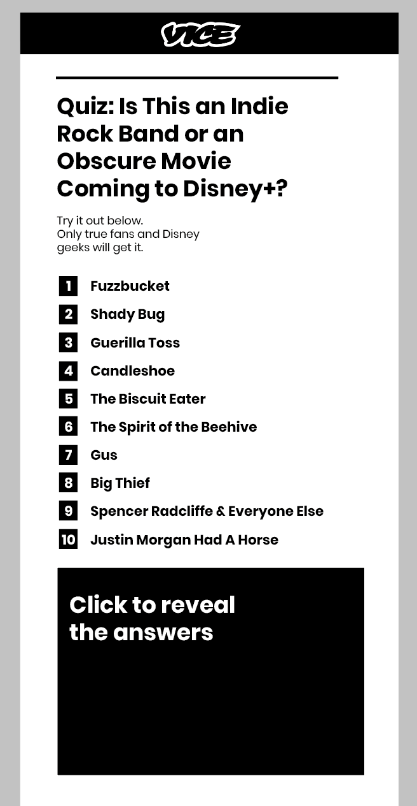
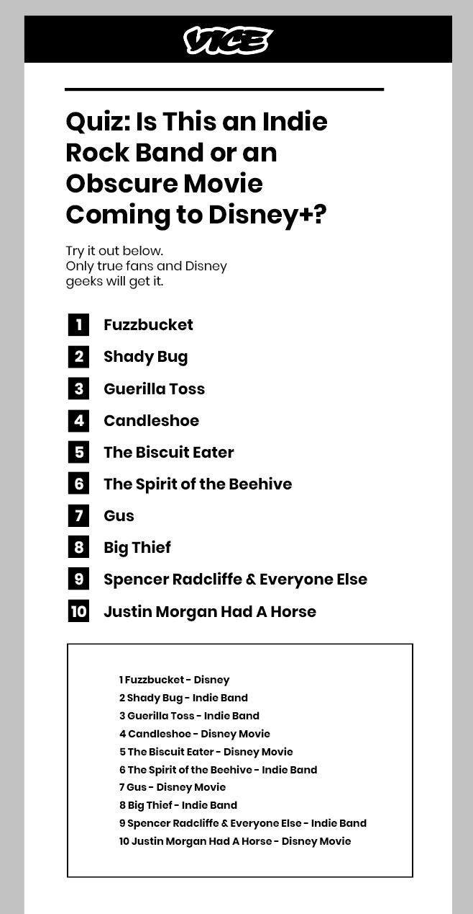

# vice

A typescript app to allow users to find out if they can spot an Indie band or a Disney movie API: http://localhost:8000/quiz-item


### Tech stack

* [Typescript](https://www.typescriptlang.org) for front & back-end
* [Node.js](https://nodejs.org/en/) for the server environment(v18.12)
* NPM (8.19.2)

## Diagrams

### Wireframe Diagram
  
  

### Typescript setup:

```
npm i - g typescript || sudo npm i - g typescript
tsc -v

tsc
node dist/index.js

```
